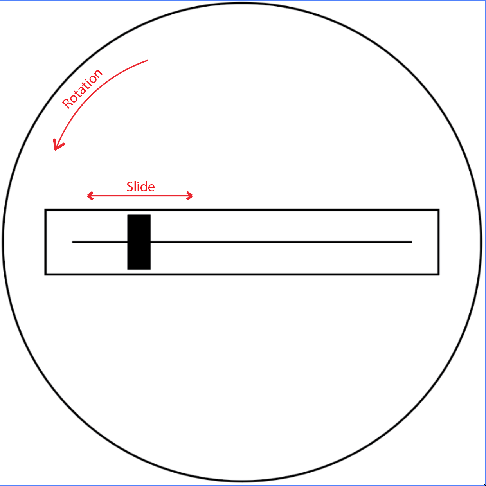

# arc

*a simple & small interaction for an expressive instrument*

## Concept
I want to create instruments that have a simple easy to use/difficult to master interface. My initial idea involved using subtractive synthesis in a MIDI aspect (more like subtractive composition), but I was struggling with the interaction itself. Amongst my iterations, there was one that really stood out: a slider on top of a rotating platform. This was what gave birth to *arc*.

The whole premise is having a slider on top of a potentiometer. The user can move the slider up and down, while rotating the whole piece to modify the value of a potentiometer underneath. Combining these elements, a series of note arrays, filters and effects are manipulated in unison.

## Development
I started crafting the main part, the top slider element. I designed a wooden case with an acrylic cover to hold everything in place; and a hole underneath to hold the potentiometer. This would be mounted on top of a wooden base, that also holds other two knobs (volume and base pitch) plus a microUSB port (for power and software update) and a headphone jack.

The software was designed for the [Teensy Audio Adaptor Board](https://www.pjrc.com/store/teensy3_audio.html) with their [Audio System Design Tool](https://www.pjrc.com/teensy/gui/index.html).

## Challenges
Sadly, the instrument is still in a non-working phase. I ran into so many issues, such as hardware failure and micro-controller crashes. I will update this over the winter whenever there's progress.
